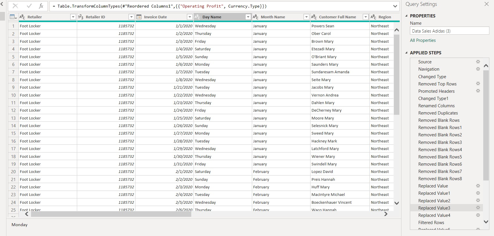
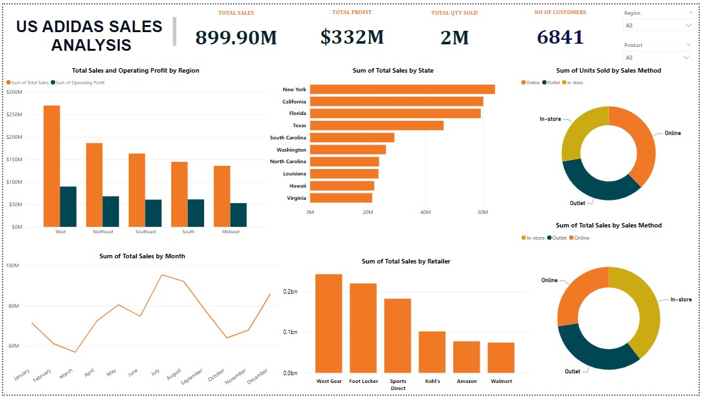

# US-ADDIDAS-SALES
This report provides an in-depth analysis of US Adidas sales performance, covering key metrics such as total sales, profit, quantity sold, and customer base.

## Table of Content

Introduction

Data Source

Tool Used

Data Transformation and Loading

Data Analysis and Visualization

Insights and Implications

Recommendation

Conclusion

- - -

## Introduction 

This report provides an in-depth analysis of US Adidas sales performance, covering key metrics such as total sales, profit, quantity sold, and customer base. 
The data is analyzed across various dimensions including region, state, month, retailer, and sales method, offering a comprehensive understanding of the company's 
performance in the US market.

## Data Source
Kaggle.com

## Tool Used
- **Microsoft Power BI** [Download here](https://www.microsoft.com/en-us/download/details.aspx?id=58494)

## Data Transformation and Loading

## Data Analysis and Visualization

## Insights

Strong overall performance: Adidas boasts impressive total sales of $899.90M and a total profit of $332M, indicating a healthy and profitable business.

-West region dominates: The West region emerges as the leading contributor to total sales, followed closely by Northeast.

-Steady growth in sales: The trend of total sales by month shows a steady growth throughout the year, peaking in July and August.

-Foot Locker as top retailer: Foot Locker emerges as the top retailer for Adidas, followed closely by West Gear.

-Online sales gaining traction: The share of online sales is increasing, with a significant portion of units being sold through this channel.

-Outlet sales still substantial: Outlet stores contribute a significant share of total sales, showcasing their continued relevance in the market.

## Recommendation

Focus on key regions: Further analyze the West and Northeast regions to identify potential growth opportunities and optimize marketing strategies.

Capitalize on online growth: Leverage the growing online sales trend by optimizing e-commerce platforms and expanding digital marketing efforts.

Strengthen relationships with top retailers: Foster stronger partnerships with top retailers like Foot Locker and West Gear to maximize sales and visibility.

Explore emerging retail channels: Explore the potential of new retail channels like social commerce or subscription services to reach new customer segments.

Analyze sales method breakdown: Conduct a detailed analysis of the sales method breakdown to understand consumer behavior and identify areas for improvement in each channel.

## Conclusion

The US Adidas sales analysis reveals a strong and profitable business with opportunities for further growth. By focusing on key regions, leveraging online channels, strengthening partnerships with key retailers, and exploring emerging channels, Adidas can continue to drive success in the US market.
